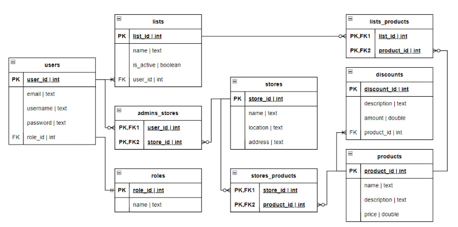

# ShopTrack — Backend

REST API built with **ASP.NET Core (C#)**, serving the ShopTrack mobile application. Handles product data, price tracking, shop management, user authentication and statistics.

> This project is the v1 prototype that evolved into [Cartoo](https://github.com/Andrew-Chek/cartoo), a full React Native rewrite currently in development.

---

## Tech Stack

| Layer | Technology |
|-------|-----------|
| Framework | ASP.NET Core |
| Language | C# |
| Architecture | Repository + Service pattern |
| Auth | JWT |

---

## Architecture

The project follows a clean layered architecture with a shared generic `CrudController` base class that all resource controllers inherit from:

```
├── Controllers/      # API endpoints (Auth + generic CRUD base)
├── Services/         # Business logic
├── Repositories/     # Data access layer
├── Models/           # Domain models
├── Middleware/       # Custom middleware (auth, error handling)
├── Program.cs        # App entry point
└── Startup.cs        # Service configuration
```

---

## Database Schema

<!-- Add your database diagram here -->


---

## API Endpoints

**Auth**

| Method | Endpoint | Description |
|--------|----------|-------------|
| POST | `/api/auth/sign-in` | Authenticate and receive JWT token |
| POST | `/api/auth/forgot-password` | Send password reset email |

**Resources** — each supports the full CRUD pattern below:

| Method | Endpoint | Description |
|--------|----------|-------------|
| GET | `/api/{resource}` | Get all items |
| GET | `/api/{resource}/{id}` | Get item by ID |
| POST | `/api/{resource}` | Create new item |
| PUT | `/api/{resource}/{id}` | Update item |
| DELETE | `/api/{resource}/{id}` | Delete item |

Available resources: `products`, `lists`, `stores`, `purchases`, `discounts`, `statistics`, `users`

> Note: `GET /api/users/{id}` requires JWT authentication.

---

## Getting Started

### Prerequisites

- .NET 6+ SDK
- A running database instance

### Installation

```bash
git clone https://github.com/Andrew-Chek/shoptrack-be.git
cd shoptrack-be
dotnet restore
```

### Configuration

Set your database connection string in `appsettings.Development.json`:

```json
{
  "ConnectionStrings": {
    "DefaultConnection": "your-connection-string-here"
  }
}
```

### Run

```bash
dotnet run
```

API will be available at `https://localhost:5001`.

---

## Frontend

The mobile client for this API lives in [shoptrack-fe](https://github.com/Andrew-Chek/shoptrack-fe) — built with Angular + Ionic for Android.

---

## Status

Diploma project — core API implemented, some endpoints incomplete. The concept has since been rebuilt from scratch as [Cartoo](https://github.com/Andrew-Chek/cartoo), a React Native app with improved architecture and geolocation-based reminders.